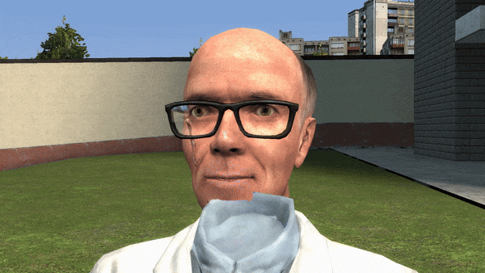

# IgnoreZ Controller

  

  <code>ignorez 1</code> <em>when Kleiner faces me;</em> <code>ignorez 0</code> <em>when Kleiner faces away.</em>

This adds a tool and system which controls the `$ignorez` material parameter through simple vector math and conditional logic. See how it works [here](./docs/COMPARISON.MD)

The default predicate function is an angle check, which is hardcoded in currently. The check determines if the angle between the view-position-and-ragdoll displacement vector and the ragdoll eye vector is less than the maximum half angle of a cone, oriented to the ragdoll's eye orientation. In other words, ignorez may be toggled depending on if you are in front of or behind the ragdoll's eyes.

I might add the ability to use other predicate functions, but for the purpose of gmod animations, the angle check suffices.

## Use Cases

- Render materials in front of other materials if the player is facing the ragdoll's head directly;
  - This could be used to mimic rendering eyebrows and eyelashes in front of hair for cartoon characters.
- Have a use case? Feel free to suggest it [here](https://github.com/vlazed/ignorez-controller/discussions/1)

## Assumptions

One expected use case of this tool is to render parts of a character in front of others: irises, eyebrows, eyelashes in front of hair, for example. Since `$ignorez` is a material parameter, the tool assumes that a character has its irises, eyebrows, and eyelashes split into different materials. Not all Source Engine characters are made this way; hence, the modeler may need to define additional materials for the characters to obtain the expected results.

This controller creates a lua material to prevent global modifications to the material. However, this implementation disables Nvidia ambient occlusion on the model with the controlled material. To work around this, define a `$translucent` flag in any material.

By default, the tool assumes an "eyes" attachment to the ragdoll's head, with "proper" orientation. "Proper" is roughly defined by whether the spawnlist icon of the model faces us (like the HL2 models). If there is no eyes attachment or the eyes are not properly oriented, the tool also allows users to specify a bone to perform calculations, with additional configuration to offset the forward vector orientation of the bone. It is up to the animator or modeler to decide on which option works for them.

This tool is expected to work in **singleplayer**. I have not tested this in multiplayer, but this tool does bridge entity properties across the server and client (which material is controlled, and what are their props, per entity). File an issue if you believe there is a bug with the tool.

## Acknowledgements

- [visual3dmasks_testdemo](https://github.com/2016killer/visual3dmasks_testdemo): Reading through this repository helped ease the transition into developing a slightly more sophisticated gmod addon. Hence, this tool's code is partially inspired by the practices in the visual3dmasks repo.
