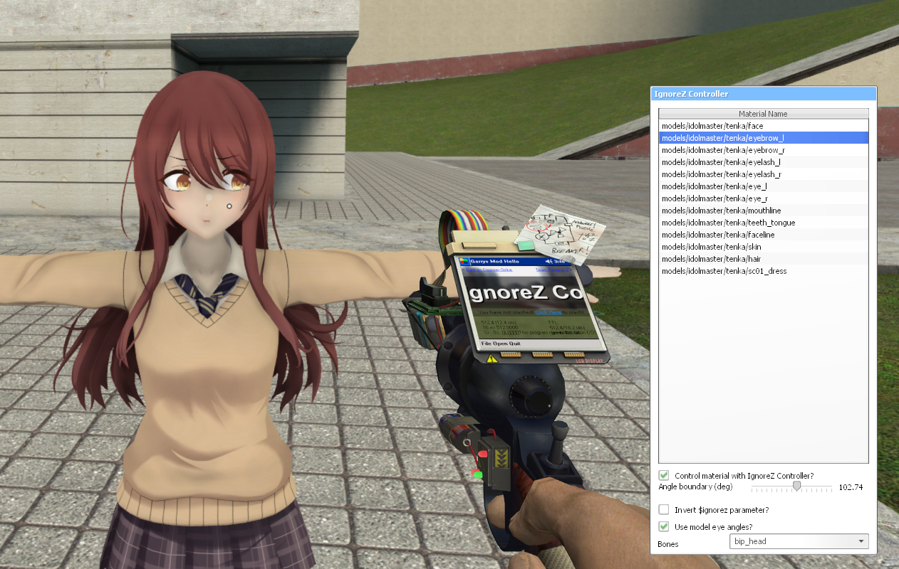
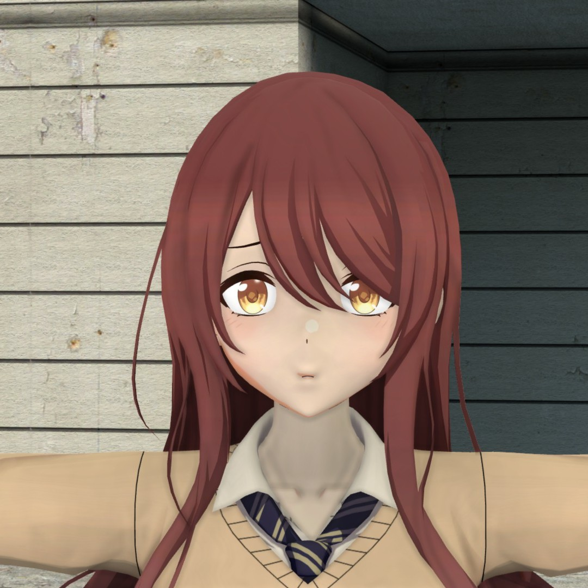

## Video Preview

## Model Details

This ported model has a translucent flag on the eyebrows and eyelashes. Adding $translucent flag is the current, intended method of identifying a material to control using this tool. Materials without $translucent work still.

In addition, I defined and oriented an "eyes" attachment in its qc file. 

See the Assumptions header in the README for more details.

## Control Panel Preview

## Comparison

`ignorez 0`             |  `$ignorez 1` 
:-------------------------:|:-------------------------:
  |  
  |  
